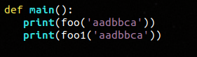
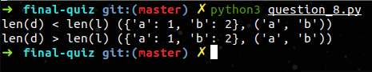

# 基础班阶段考试

1. **列出所学过的数值类型，序列类型，散列类型**  (10分)

   ```python
   答案 = {
   	数值类型: [int, float, decimal.Decimal, bool, complex], 
   	序列类型: [str, bytes, list, tuple],
   	散列类型: [set, dict]}
   ```

   **[See Code](question_1.py)**


2. 如何捕获指定类型的异常  (10分)

   ```python
   答案 = 使用 try/except 语句
   ```

   **[See Code](question_2.py)**

   

3. 如何通过Python代码打开当前目录下的 log.txt 文件  (10分)

   ```python
   答案 = 使用内置函数 open 
   ```

   **[See Code](question_3.py)**

   

4. 使用推导表达式生成一个列表，列表中的元素为1到100的所有奇数  (10分)

   ```python
   答案 = [i for i in range(1, 101) if i%2]
   ```

   **[See Code](question_4.py)**

   

5. 定义一个函数 (15分) :    

      - 可以给函数传入一个 字符串  
      - 返回该字符串由哪些符号组成  
      - 例如： "abacad" 这个字符串由 a b c d 组成  

      **核心代码**:

      

      **主函数代码**:

      

      

      **测试结果:**

      

      **[See Full Code](question_5.py)**

6. 定义一个Person类，这个类创建的实例需要有名字，年纪，职业三个属性， 这个类的实例之间可以像函数一样直接被调用，调用的时候打印出实例的姓名  年纪  和属性，实例被销毁的时候打印 名字和年纪 (15分)

      **核心代码**: 

      

      

      **主函数代码**:

      

      **测试结果**:

      

      **[See Full code](question_6.py)**

      

7. 输入一个序列，判断这个序列是升序，降序还是无序。 说明：排序规则，是Python默认的排序规则. （10分）要求：

      - 如果是升序，输出'UP' 

      - 如果是降序，输出'DOWN' 

      - 如果无序，输出None 

        ```jade
        # 程序输出应该如下所示
        >>> which_order('abc') 
        UP 
        >>> which_order([3,2,1]) 
        DOWN 
        >>> which_order('132')
        >>>
        ```
        **核心代码:**

        

        **程序测试结果:**

        
        **[See Full Code](question_7.py)**


8. 定义一个函数（20分）

    - 要求可以传入一个字典和列表
    - 要求字典和列表的长度不相等
    - 字典和列表长度变为一样的长度
    - 字典的value值和列表的元素互换
    - 返回一个字典和元祖

    ```jade
    # 程序输出应该如下所示
    >>> exchange_body({"k1":"v1", "k2":"v2"},  ["l1", "l2", "l3"])
    {"k1":"l1", "k2":"l2"} ["v1", "v2"]
    ```

    **核心代码:**

    

    **主函数代码:**

    

    **测试结果:**

    

    **[See Full Code](question_8.py)**

